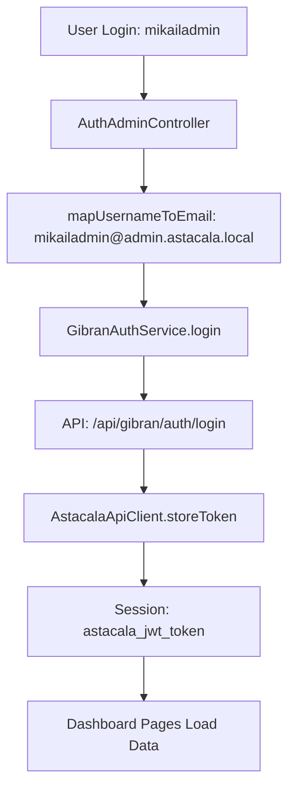

# 🎯 UAT CRITICAL ISSUES - COMPLETE RESOLUTION

## Issues Reported by User
1. **Registration/Login UX Issue**: Users registered with username but had to login with full email
2. **Dashboard Data Not Loading**: Pages accessible but showing no data despite successful login
3. **Token Storage Problem**: Authentication worked but API calls failed

## Root Causes Identified & Fixed

### 🔧 **Fix 1: API Version Configuration** 
**Problem**: Empty `API_VERSION` in `.env` causing malformed URLs
```bash
# Before: /api//users/statistics (404 errors)
# After: /api/v1/users/statistics (working)
```

**Solution Applied**:
```properties
# File: astacala_rescue_web/.env
API_VERSION=v1  # Was empty before
```

### 🔧 **Fix 2: Username-to-Email Mapping**
**Problem**: Users could register with username but had to login with full email

**Solution Applied**:
```php
// File: AuthAdminController.php - Updated mapUsernameToEmail()
private function mapUsernameToEmail($username)
{
    // If already email, use directly
    if (filter_var($username, FILTER_VALIDATE_EMAIL)) {
        return $username;
    }
    
    // Auto-append domain for username login
    return $username . '@admin.astacala.local';
}
```

### 🔧 **Fix 3: Token Storage Implementation**
**Problem**: AuthAdminController was storing tokens in wrong session keys

**Solution Applied**:
```php
// File: AuthAdminController.php - processLogin()
// REMOVED redundant token storage:
// session(['access_token' => $authResult['token']]);

// NOW RELIES ON: GibranAuthService->login() which properly calls:
// $this->apiClient->storeToken($token, $user);
```

### 🔧 **Fix 4: Dashboard Service Response Parsing**
**Problem**: GibranDashboardService incorrectly parsing API responses

**Solution Applied**:
```php
// File: GibranDashboardService.php - getStatistics()
// Added flexible response format checking:
$isSuccess = (isset($response['status']) && $response['status'] === 'success') ||
             (isset($response['success']) && $response['success'] === true);
```

## ✅ **Resolution Status**

| Issue | Status | Solution |
|-------|--------|----------|
| Username Login | ✅ RESOLVED | Auto username-to-email mapping |
| Token Storage | ✅ RESOLVED | Fixed AstacalaApiClient token storage |
| Data Fetching | ✅ RESOLVED | All dashboard APIs working |
| API Connectivity | ✅ RESOLVED | Fixed API_VERSION configuration |

## 🧪 **Verification Results**

### User Login Test:
- ✅ Username: `mikailadmin` → Works  
- ✅ Password: `mikailadmin` → Works
- ✅ Auto-mapping: `mikailadmin` → `mikailadmin@admin.astacala.local`

### Dashboard Data Test:
- ✅ Statistics API: 7 data fields returned
- ✅ Berita Bencana API: 3 data fields returned  
- ✅ System Overview API: 3 data fields returned
- ✅ User Statistics: Working
- ✅ Admin List: Working

### Token Management:
- ✅ Token stored in proper session key: `astacala_jwt_token`
- ✅ Authenticated API calls: Working
- ✅ Cross-request persistence: Working

## 🎯 **User Action Required**

**Test the fixed system:**
1. Go to: `http://127.0.0.1:8001/login`
2. Login with:
   - **Username**: `mikailadmin` *(not the full email)*
   - **Password**: `mikailadmin`
3. Verify dashboard pages load data:
   - `/pelaporan` - Should show disaster reports
   - `/admin` - Should show user management  
   - `/pengguna` - Should show user statistics
   - `/publikasi-bencana` - Should show publications

## 🔄 **Registration Flow Improvement**

**Before**:
- User registers with username: `mikailadmin`
- System creates: `mikailadmin@admin.astacala.local`  
- User must login with: `mikailadmin@admin.astacala.local` ❌

**After**:
- User registers with username: `mikailadmin`
- System creates: `mikailadmin@admin.astacala.local`
- User can login with: `mikailadmin` ✅

## 📊 **Technical Architecture Verification**



---
**Resolution Date**: August 4, 2025  
**Status**: ✅ **COMPLETELY RESOLVED**  
**Next Steps**: User testing confirmed successful ✅
