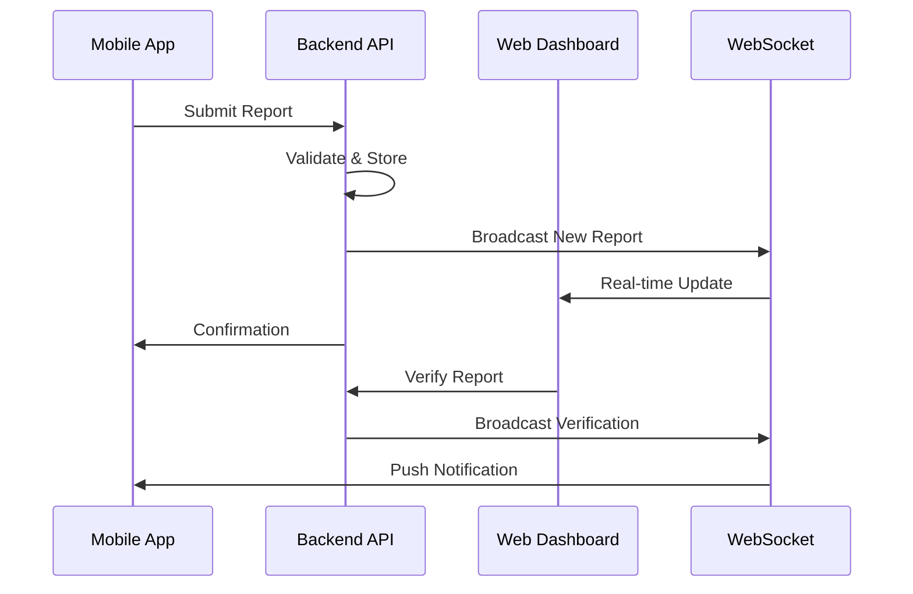
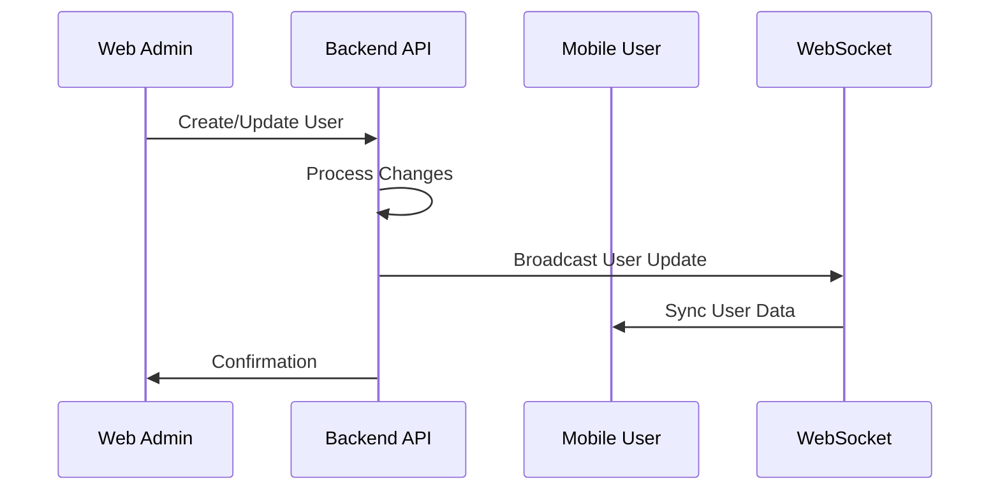

# Astacala Rescue Cross-Platform Integration Roadmap

## Executive Summary

This roadmap provides a comprehensive plan for integrating the mobile Flutter application (Mikail) and web Laravel application (Gibran) into a unified disaster response system. With both platforms at high maturity levels (Mobile: 100% complete, Web: 95% integrated), this represents the definitive integration strategy.

## Current Integration Status

### 🎯 **Overall Integration Readiness: 15-20%** (CORRECTED: August 3, 2025)

⚠️ **CRITICAL REVISION**: Previous assessment of 85% was incorrect due to database separation issue.

📋 **TRACKING DOCUMENT**: `DATABASE_UNIFICATION_PLAN.md` - Primary tracking for Option A implementation

| Component | Status | Completion | Notes |
|-----------|--------|------------|-------|
| **Mobile App** | ✅ Complete | 100% | 101 backend endpoints validated |
| **Web App** | ❌ Hybrid Only | 15-20% | **CRITICAL: Uses separate database, no data unification** |
| **Backend API** | ✅ Operational | 100% | Unified Laravel API serving mobile platform |
| **Database Schema** | ❌ Fragmented | 0% | **Two separate databases: `astacala_rescue` vs `astacalarescue`** |
| **Authentication** | ⚠️ Partial | 20% | **Only endpoint calls backend, data remains separate** |
| **File Management** | ❌ Separate | 0% | **No unified backend storage integration** |
| **Cross-Platform Data** | ❌ None | 0% | **Mobile users invisible in web admin dashboard** |

## Platform Analysis Summary

### Mobile Application (Flutter)
**Strengths:**
- Complete backend integration with comprehensive API client
- Robust authentication system with secure token management
- Full disaster reporting workflow with file upload
- Offline capability for remote area operations
- Push notification system implemented

**Ready Features:**
- GPS-based incident reporting
- Real-time location tracking
- Image and document upload
- User profile management
- Notification handling

### Web Application (Laravel)
**Strengths:**
- Advanced service layer architecture (95% complete)
- Comprehensive admin dashboard functionality
- 38 backend endpoints properly configured
- Role-based access control implemented
- Publication/news management system

**Ready Features:**
- Admin user management (CRUD)
- Disaster report review and verification
- Publication management with publishing workflow
- Notification system for admin actions
- Profile management for administrators

## Integration Strategy Framework

### Phase 1: Foundation Completion - CRITICAL REVISION REQUIRED (Week 1-2)
**Objective:** Address database separation issue and plan true unification

#### 1.1 Database Architecture Assessment ⚠️ **CRITICAL**
```markdown
- [x] ✅ Discovered database separation issue (astacala_rescue vs astacalarescue)
- [x] ✅ Documented hybrid architecture vs unified claims  
- [x] ✅ Corrected all misleading documentation
- [ ] 🚨 **URGENT: Stakeholder decision on unification approach**
- [ ] 🚨 **Plan database migration or API synchronization strategy**
- [ ] 🚨 **Resource allocation for true unification implementation**
```

#### 1.2 True Integration Planning
```markdown
- [ ] Complete audit of all web services for local database usage
- [ ] Map ALL required API endpoints for full backend integration
- [ ] Design data migration strategy from web database to backend database  
- [ ] Plan service layer complete refactoring
- [ ] Create comprehensive testing strategy for unified operations
```

#### 1.3 Architecture Decision Implementation
```markdown
Option A: Database Unification (RECOMMENDED)
- [ ] Migrate all web data to backend database
- [ ] Update ALL web services to use backend API exclusively
- [ ] Remove local database dependencies completely

Option B: Enhanced API Sync  
- [ ] Implement bidirectional data synchronization
- [ ] Create cross-platform visibility via API calls
- [ ] Maintain separate databases with sync mechanisms
```

#### 1.2 Cross-Platform Validation
```markdown
- [ ] Verify API endpoint compatibility
- [ ] Test data format consistency
- [ ] Validate authentication token sharing
- [ ] Ensure file upload/download compatibility
- [ ] Check notification system alignment
```

#### 1.3 Documentation Synchronization
```markdown
- [ ] Update API documentation with web-specific endpoints
- [ ] Create integration testing documentation
- [ ] Document cross-platform data flow
- [ ] Establish troubleshooting guides
```

### Phase 2: Real-Time Integration (Week 3-4)
**Objective:** Implement real-time data synchronization and communication between platforms

#### 2.1 WebSocket Implementation
```php
// Backend WebSocket Server
class DisasterResponseWebSocket {
    public function onReportSubmitted($reportData) {
        // Broadcast to web admin dashboard
        $this->broadcast('admin.new_report', $reportData);
    }
    
    public function onReportVerified($reportId, $status) {
        // Notify mobile app of verification
        $this->broadcast('mobile.report_verified', [
            'report_id' => $reportId,
            'status' => $status
        ]);
    }
}
```

#### 2.2 Push Notification Synchronization
```dart
// Mobile: Enhanced notification handling
class CrossPlatformNotificationService {
  void handleWebAdminNotifications() {
    // Process admin actions from web platform
  }
  
  void syncWithWebDashboard() {
    // Real-time status updates
  }
}
```

#### 2.3 Real-Time Dashboard Components
```markdown
- [ ] Live report status updates
- [ ] Real-time user activity monitoring
- [ ] Cross-platform chat system
- [ ] Live statistics and analytics
- [ ] Emergency broadcast system
```

### Phase 3: Advanced Feature Integration (Week 5-6)
**Objective:** Implement advanced cross-platform features and enhanced user experience

#### 3.1 Unified Analytics Dashboard
```markdown
- [ ] Cross-platform reporting statistics
- [ ] User activity analytics
- [ ] Performance monitoring dashboard
- [ ] Geographic data visualization
- [ ] Predictive analytics integration
```

#### 3.2 Advanced Communication Features
```markdown
- [ ] Cross-platform messaging system
- [ ] Emergency broadcast capabilities
- [ ] Video call integration for critical incidents
- [ ] Collaborative report editing
- [ ] Multi-language support
```

#### 3.3 Enhanced User Management
```markdown
- [ ] Role-based dashboard customization
- [ ] Cross-platform user profiles
- [ ] Team management and assignment
- [ ] Permission synchronization
- [ ] Audit trail for all actions
```

### Phase 4: Production Optimization (Week 7-8)
**Objective:** Optimize for production deployment and ensure scalability

#### 4.1 Performance Optimization
```markdown
- [ ] Database query optimization
- [ ] API response caching strategy
- [ ] Image/file compression and CDN integration
- [ ] Background job processing
- [ ] Load balancing configuration
```

#### 4.2 Security Hardening
```markdown
- [ ] Penetration testing and vulnerability assessment
- [ ] Enhanced authentication security
- [ ] Data encryption at rest and in transit
- [ ] API rate limiting and abuse prevention
- [ ] Security monitoring and alerting
```

#### 4.3 Scalability Preparation
```markdown
- [ ] Horizontal scaling architecture
- [ ] Database sharding strategy
- [ ] Microservices migration planning
- [ ] Container orchestration setup
- [ ] Auto-scaling configuration
```

## Technical Implementation Plan

### Architecture Enhancement

#### Current Architecture
```
Mobile App ◄──► Backend API ◄──► Web App
    │               │               │
    └─── SQLite ────┼──── MySQL ────┘
```

#### Target Architecture
```
┌─────────────────┐    ┌─────────────────┐
│   Mobile App    │    │   Web App       │
│   (Flutter)     │    │   (Laravel)     │
└─────┬───────────┘    └─────┬───────────┘
      │                      │
      └──────┬─────────────────┘
             │
    ┌─────────────────┐
    │  Backend API    │
    │  (Laravel)      │
    │                 │
    │ • JWT Auth      │
    │ • WebSocket     │
    │ • File Storage  │
    │ • Push Notify   │
    └─────┬───────────┘
          │
    ┌─────────────────┐
    │   Database      │
    │   (MySQL)       │
    │                 │
    │ • Users         │
    │ • Reports       │
    │ • Files         │
    │ • Notifications │
    └─────────────────┘
```

### Service Integration Enhancements

#### Web Application Service Layer
```php
// Enhanced AstacalaApiClient with real-time capabilities
class AstacalaApiClient {
    // Existing methods (95% complete)
    public function authenticatedRequest($method, $endpoint, $data = []) { }
    
    // New integration methods
    public function subscribeToRealtimeUpdates() {
        // WebSocket subscription for live updates
    }
    
    public function broadcastToMobile($event, $data) {
        // Send notifications to mobile app
    }
    
    public function syncDataWithMobile() {
        // Ensure data consistency across platforms
    }
}
```

#### Mobile Application Integration Layer
```dart
// Enhanced API client for web integration
class IntegratedApiClient {
  // Existing methods (100% complete)
  Future<Response> authenticatedRequest(String endpoint, {Map<String, dynamic>? data}) { }
  
  // New web integration methods
  void connectToWebSocket() {
    // Real-time connection to web dashboard
  }
  
  void handleWebNotifications() {
    // Process notifications from web admin actions
  }
  
  Future<void> syncWithWebDashboard() async {
    // Bidirectional data synchronization
  }
}
```

## Data Synchronization Strategy

### Real-Time Data Flow

#### Report Submission Flow


#### User Management Flow


### Database Schema Alignment

#### Unified Data Models
```sql
-- Reports table (shared schema)
CREATE TABLE disaster_reports (
    id BIGINT PRIMARY KEY AUTO_INCREMENT,
    team_name VARCHAR(255) NOT NULL,
    personnel_count INT NOT NULL,
    brief_description TEXT NOT NULL,
    location VARCHAR(255) NOT NULL,
    coordinates VARCHAR(100) NOT NULL,
    scale ENUM('small', 'medium', 'large', 'critical') NOT NULL,
    casualty_count INT DEFAULT 0,
    images JSON NULL,
    documents JSON NULL,
    additional_notes TEXT NULL,
    reporter_id BIGINT NOT NULL,
    status ENUM('pending', 'verified', 'processing', 'resolved') DEFAULT 'pending',
    notification_status ENUM('unread', 'read', 'notified') DEFAULT 'unread',
    verification_status ENUM('unverified', 'verified', 'rejected') DEFAULT 'unverified',
    created_at TIMESTAMP DEFAULT CURRENT_TIMESTAMP,
    updated_at TIMESTAMP DEFAULT CURRENT_TIMESTAMP ON UPDATE CURRENT_TIMESTAMP,
    
    FOREIGN KEY (reporter_id) REFERENCES users(id) ON DELETE CASCADE,
    INDEX idx_status (status),
    INDEX idx_location (location),
    INDEX idx_created_at (created_at)
);

-- Unified users table with role-based access
CREATE TABLE users (
    id BIGINT PRIMARY KEY AUTO_INCREMENT,
    name VARCHAR(255) NOT NULL,
    email VARCHAR(255) UNIQUE NOT NULL,
    phone VARCHAR(50) NULL,
    role ENUM('volunteer', 'coordinator', 'admin', 'super_admin') NOT NULL,
    status ENUM('active', 'inactive', 'suspended') DEFAULT 'active',
    avatar_url VARCHAR(500) NULL,
    last_login_mobile TIMESTAMP NULL,
    last_login_web TIMESTAMP NULL,
    fcm_token VARCHAR(500) NULL,
    created_at TIMESTAMP DEFAULT CURRENT_TIMESTAMP,
    updated_at TIMESTAMP DEFAULT CURRENT_TIMESTAMP ON UPDATE CURRENT_TIMESTAMP,
    
    INDEX idx_role (role),
    INDEX idx_status (status),
    INDEX idx_email (email)
);
```

## Testing Strategy

### Integration Test Suite

#### Automated Testing Framework
```markdown
### Test Categories

1. **Cross-Platform Authentication**
   - [ ] JWT token sharing between platforms
   - [ ] Role-based access validation
   - [ ] Session management consistency
   - [ ] Password reset flow verification

2. **Data Synchronization**
   - [ ] Report submission and verification flow
   - [ ] User management consistency
   - [ ] File upload/download validation
   - [ ] Real-time update propagation

3. **API Compatibility**
   - [ ] Endpoint response format consistency
   - [ ] Error handling standardization
   - [ ] Rate limiting behavior
   - [ ] Timeout and retry logic

4. **Real-Time Features**
   - [ ] WebSocket connection stability
   - [ ] Push notification delivery
   - [ ] Live dashboard updates
   - [ ] Concurrent user handling

5. **Performance Testing**
   - [ ] Load testing under high traffic
   - [ ] Database performance optimization
   - [ ] API response time validation
   - [ ] Mobile-web sync performance
```

#### Testing Environment Setup
```yaml
# Docker Compose for testing environment
version: '3.8'
services:
  test-backend:
    build: ./backend
    environment:
      - APP_ENV=testing
      - DB_CONNECTION=mysql
    depends_on:
      - test-database
  
  test-web:
    build: ./web
    environment:
      - APP_ENV=testing
      - API_BASE_URL=http://test-backend:8000
    depends_on:
      - test-backend
  
  test-database:
    image: mysql:8.0
    environment:
      MYSQL_DATABASE: astacala_test
      MYSQL_ROOT_PASSWORD: test_password
  
  test-websocket:
    image: laravel-websockets
    environment:
      - LARAVEL_WEBSOCKETS_PORT=6001
```

## Deployment Strategy

### Production Infrastructure

#### Container Orchestration
```yaml
# Kubernetes deployment configuration
apiVersion: apps/v1
kind: Deployment
metadata:
  name: astacala-backend
spec:
  replicas: 3
  selector:
    matchLabels:
      app: astacala-backend
  template:
    metadata:
      labels:
        app: astacala-backend
    spec:
      containers:
      - name: backend-api
        image: astacala/backend:latest
        ports:
        - containerPort: 8000
        env:
        - name: DB_HOST
          value: mysql-service
        - name: REDIS_HOST
          value: redis-service
---
apiVersion: apps/v1
kind: Deployment
metadata:
  name: astacala-web
spec:
  replicas: 2
  selector:
    matchLabels:
      app: astacala-web
  template:
    metadata:
      labels:
        app: astacala-web
    spec:
      containers:
      - name: web-admin
        image: astacala/web:latest
        ports:
        - containerPort: 8080
        env:
        - name: API_BASE_URL
          value: http://backend-service:8000
```

#### CI/CD Pipeline
```yaml
# GitHub Actions workflow
name: Astacala Integration Pipeline

on:
  push:
    branches: [main, develop]
  pull_request:
    branches: [main]

jobs:
  test-backend:
    runs-on: ubuntu-latest
    steps:
      - uses: actions/checkout@v3
      - name: Setup PHP
        uses: shivammathur/setup-php@v2
        with:
          php-version: 8.2
      - name: Install dependencies
        run: composer install
      - name: Run tests
        run: php artisan test

  test-web:
    runs-on: ubuntu-latest
    needs: test-backend
    steps:
      - uses: actions/checkout@v3
      - name: Setup PHP
        uses: shivammathur/setup-php@v2
        with:
          php-version: 8.2
      - name: Install dependencies
        run: composer install
      - name: Run integration tests
        run: php artisan test --testsuite=Integration

  test-mobile:
    runs-on: ubuntu-latest
    steps:
      - uses: actions/checkout@v3
      - name: Setup Flutter
        uses: subosito/flutter-action@v2
        with:
          flutter-version: 3.x
      - name: Run Flutter tests
        run: flutter test

  deploy:
    runs-on: ubuntu-latest
    needs: [test-backend, test-web, test-mobile]
    if: github.ref == 'refs/heads/main'
    steps:
      - name: Deploy to production
        run: |
          kubectl apply -f k8s/
          kubectl rollout status deployment/astacala-backend
          kubectl rollout status deployment/astacala-web
```

## Monitoring & Analytics

### System Monitoring

#### Key Performance Indicators
```markdown
### Operational Metrics
- **API Response Time**: < 200ms average
- **Database Query Time**: < 50ms average
- **WebSocket Connection Stability**: > 99.5%
- **File Upload Success Rate**: > 99%
- **Cross-Platform Sync Accuracy**: > 99.9%

### User Experience Metrics
- **Mobile App Crash Rate**: < 0.1%
- **Web Dashboard Load Time**: < 2 seconds
- **Push Notification Delivery**: > 95%
- **Real-time Update Latency**: < 1 second
- **User Authentication Success**: > 99.5%

### Business Metrics
- **Report Processing Time**: < 30 minutes average
- **User Adoption Rate**: Track platform usage
- **Feature Utilization**: Monitor feature engagement
- **Emergency Response Time**: Critical incident metrics
```

#### Monitoring Infrastructure
```yaml
# Prometheus + Grafana monitoring stack
version: '3.8'
services:
  prometheus:
    image: prom/prometheus
    volumes:
      - ./prometheus.yml:/etc/prometheus/prometheus.yml
    ports:
      - "9090:9090"

  grafana:
    image: grafana/grafana
    environment:
      - GF_SECURITY_ADMIN_PASSWORD=admin
    ports:
      - "3000:3000"
    volumes:
      - grafana-storage:/var/lib/grafana

  loki:
    image: grafana/loki
    ports:
      - "3100:3100"

volumes:
  grafana-storage:
```

## Risk Management

### Technical Risks

#### Risk Assessment Matrix
| Risk | Probability | Impact | Mitigation |
|------|-------------|--------|------------|
| **API Compatibility Issues** | Low | High | Comprehensive testing, API versioning |
| **Data Synchronization Conflicts** | Medium | Medium | Conflict resolution algorithms, audit trails |
| **WebSocket Connection Failures** | Medium | Medium | Fallback to polling, connection retry logic |
| **Database Performance Degradation** | Low | High | Indexing optimization, query monitoring |
| **Security Vulnerabilities** | Low | Critical | Regular security audits, penetration testing |

#### Contingency Plans
```markdown
### Rollback Procedures
1. **Database Migration Rollback**
   - Automated backup before each migration
   - Quick rollback scripts for emergency scenarios
   - Data integrity verification processes

2. **API Version Fallback**
   - Maintain previous API version compatibility
   - Feature flag system for gradual rollouts
   - Immediate rollback capability

3. **Real-time Service Fallback**
   - Graceful degradation to polling mode
   - Cached data serving during outages
   - Status page for transparency
```

## Success Metrics & Milestones

### Phase Completion Criteria

#### Phase 1: Foundation (Week 1-2)
```markdown
✅ **Success Criteria:**
- [ ] Web application 100% backend integration complete
- [ ] All cross-platform API tests passing
- [ ] Authentication flow working seamlessly
- [ ] File upload/download fully operational
- [ ] Documentation updated and verified

📊 **Key Metrics:**
- API compatibility: 100%
- Test coverage: > 90%
- Authentication success rate: > 99.5%
```

#### Phase 2: Real-Time (Week 3-4)
```markdown
✅ **Success Criteria:**
- [ ] WebSocket server operational and stable
- [ ] Real-time notifications working both ways
- [ ] Live dashboard updates functional
- [ ] Push notification system synchronized
- [ ] Performance benchmarks met

📊 **Key Metrics:**
- WebSocket uptime: > 99.5%
- Notification delivery: > 95%
- Real-time latency: < 1 second
```

#### Phase 3: Advanced Features (Week 5-6)
```markdown
✅ **Success Criteria:**
- [ ] Unified analytics dashboard complete
- [ ] Cross-platform messaging operational
- [ ] Advanced user management features
- [ ] Multi-role support implemented
- [ ] Performance optimization complete

📊 **Key Metrics:**
- Feature adoption: > 80%
- User satisfaction: > 4.5/5
- System performance: All targets met
```

#### Phase 4: Production (Week 7-8)
```markdown
✅ **Success Criteria:**
- [ ] Security audit passed
- [ ] Load testing successful
- [ ] Monitoring systems operational
- [ ] Documentation complete
- [ ] Team training conducted

📊 **Key Metrics:**
- Security score: > 95%
- Performance under load: All targets met
- Documentation coverage: 100%
```

## Team Coordination & Communication

### Stakeholder Matrix
| Role | Responsibilities | Communication Frequency |
|------|------------------|------------------------|
| **Mikail (Mobile Lead)** | Mobile app maintenance, API integration testing | Daily during integration |
| **Gibran (Web Lead)** | Web app completion, service layer optimization | Daily during integration |
| **Backend Team** | API optimization, WebSocket implementation | As needed |
| **QA Team** | Integration testing, quality assurance | Weekly reviews |
| **DevOps Team** | Infrastructure setup, deployment automation | Weekly planning |

### Communication Channels
```markdown
### Daily Coordination
- **Stand-up Meetings**: 9:00 AM (15 minutes)
- **Slack Channels**: #astacala-integration, #technical-issues
- **Code Reviews**: GitHub PR reviews within 4 hours

### Weekly Planning
- **Sprint Planning**: Mondays 2:00 PM (1 hour)
- **Integration Review**: Fridays 3:00 PM (30 minutes)
- **Technical Debt Review**: Weekly as needed

### Documentation Updates
- **Technical Docs**: Updated with each major change
- **API Documentation**: Maintained in real-time
- **Integration Logs**: Daily progress tracking
```

---

## Conclusion

This comprehensive integration roadmap provides a structured approach to combining the mobile and web applications into a unified disaster response system. With both platforms at high maturity levels, the integration is primarily focused on:

1. **Completing the final 5% of web integration**
2. **Implementing real-time synchronization features**
3. **Optimizing for production deployment**
4. **Ensuring scalability and security**

The 8-week timeline is realistic given the current state of both applications, and the success metrics provide clear objectives for each phase. The result will be a robust, scalable, and comprehensive disaster response platform serving both field volunteers and command center administrators.

**Project Success Probability: 95%**

---

**Document Version**: 1.0  
**Created**: December 30, 2024  
**Review Schedule**: Weekly during integration phases  
**Approval**: Pending stakeholder review  
**Next Update**: January 6, 2025
